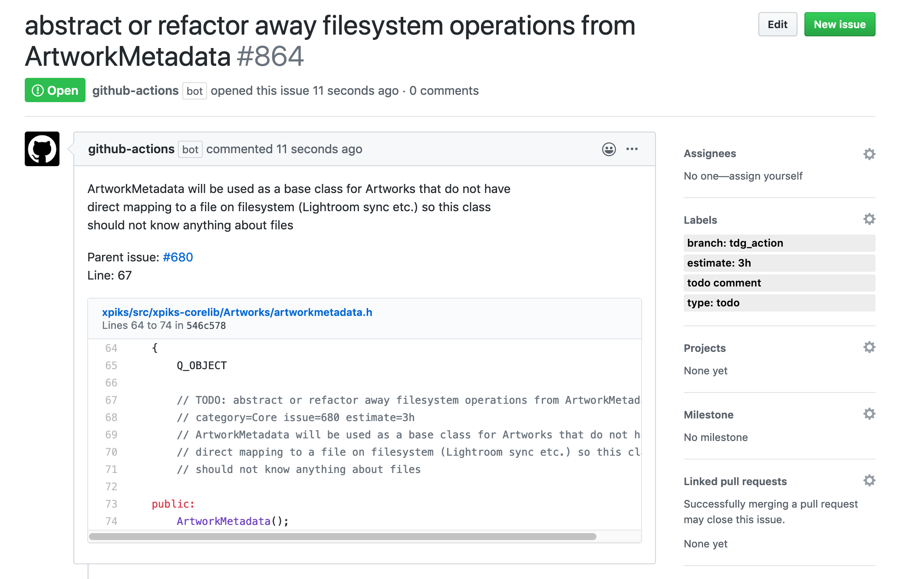

# Turn your TODO comments into GitHub Issues

[](https://github.com/ribtoks/tdg-github-action/actions)
[](https://github.com/ribtoks/tdg-github-action/actions)

GitHub Action that will manage issues based on `TODO`/`BUG`/`FIXME`/`HACK` comments in the source code. Optionally issues are added to a Project Column that you specify. Source code is parsed using [tdg](https://github.com/ribtoks/tdg) which supports comments for almost all existing languages.

When a new todo comment is added, a new issue is created. When this comment is removed on the branch it was added, the corresponding issue is closed. Each issue is added with a special label so you can build more automation on top of it.

## Screenshot



## Usage

Create a workflow file in your `.github/workflows/` directory with the following contents:

### Basic example

```yaml
name: TODO workflow
on: [push, pull_request]
jobs:
  build:
    runs-on: ubuntu-latest
    steps:
    - uses: actions/checkout@master
    - name: Run tdg-github-action
      uses: ribtoks/tdg-github-action@master
      with:
        TOKEN: ${{ secrets.GITHUB_TOKEN }}
        REPO: ${{ github.repository }}
        SHA: ${{ github.sha }}
        REF: ${{ github.ref }}
```

> **NOTE:** Please note that currently GitHub has 5000 requests per hour limit so if you are running it on a fresh repository and you have lots of todos in comments, you may hit this limit.

You can use this action together with [parent issue updater](https://github.com/ribtoks/parent-issue-update) in order to automatically keep track of child TODO items in parent issues. For that you need to use `issue=123` extension in the TODO comment - see example below.

### Inputs

| Input | Description |
|---|---|
| `REPO`  | Repository name in the format of `owner/repo` (required)   |
| `TOKEN`  | Github token used to create or close issues (required)  |
| `REF`  | Git ref: branch or pull request (required)|
| `SHA`  | SHA-1 value of the commit (required) |
| `ROOT`  | Source code root (defaults to `.`) |
| `LABEL`  | Label to add to the new issues (defaults to `todo comment`) |
| `EXTENDED_LABELS`  | Add additional labels to mark branch, issue type and estimate |
| `CLOSE_ON_SAME_BRANCH`  | Close issues only if they are missing from the same branch as they were created on (by default) |
| `PROJECT_COLUMN_ID`  | Automatically create a project card in this column for new issue (none by default) |
| `INCLUDE_PATTERN`  | Regex to include source code files (includes all by default) |
| `EXCLUDE_PATTERN`  | Regex to exclude source code files (excludes none by default) |
| `MIN_WORDS`  | Minimum number of words in the comment to become an issue (defaults to `3`) |
| `MIN_CHARACTERS`  | Minimum number of characters in the comment to become an issue (defaults to `30`) |
| `DRY_RUN`  | Do not open or close real issues (used for debugging) |
| `ADD_LIMIT`  | Upper cap on the number of issues to create (defaults to `0` - unlimited) |
| `CLOSE_LIMIT`  | Upper cap on the number of issues to close (defaults to `0` - unlimited) |
| `COMMENT_ON_ISSUES` | Leave a comment in which commit the issue was closed (defaults to `0` - do not comment) |
| `CONCURRENCY` | How many files to process in parallel (defaults to `128`) |

> **NOTE:** Keep in mind that you have to escape slashes in regex patterns when putting them to yaml

Flag values like `CLOSE_ON_SAME_BRANCH` or `DRY_RUN` use values `1`/`true`/`y` as ON switch.

In order to get a column ID, you can go to your project and press "Copy column link" in the column 3 dots menu. ID is the last part of the URL `https://github.com/owner/repo/projects/5#column-823438` (ID would be `823438`).

In case you are disabling `EXTENDED_LABELS`, then `CLOSE_ON_SAME_BRANCH` logic will be broken since there will be no knowledge on which branch the issue was created (for new issues), effectively making it disabled.

### Outputs

| Output                                             | Description                                        |
|------------------------------------------------------|-----------------------------------------------|
| `scannedIssues`  | Equals to `1` if completed successfully    |

## Examples

### Workflow

```yaml
name: TDG
on: [push, pull_request]
jobs:
  build:
    runs-on: ubuntu-latest
    steps:
    - uses: actions/checkout@master
    - name: Run tdg-github-action
      uses: ribtoks/tdg-github-action@master
      with:
        TOKEN: ${{ secrets.GITHUB_TOKEN }}
        REPO: ${{ github.repository }}
        SHA: ${{ github.sha }}
        REF: ${{ github.ref }}
        LABEL: "my label"
        MIN_WORDS: 3
        MIN_CHARACTERS: 40
        ADD_LIMIT: 1
        CLOSE_LIMIT: 1
        ROOT: "src"
        PROJECT_COLUMN_ID: 824533
        INCLUDE_PATTERN: "\\.(cpp|h)$"
```

Note escaped regex.

If you want to only process TODO comments from master branch, modify the workflow `on` section like this:

```yaml
on:
  # only for the master branch
  push:
    branches:
    - master
```

### TODO comments

Comments are parsed using [tdg](https://github.com/ribtoks/tdg). Supported comments: `//`, `#`, `%`, `;`, `*`.

Example of the comment (everything but the first line is optional):

    // TODO: This is title of the issue to create
    // category=SomeCategory issue=123 estimate=30m author=alias
    // This is a multiline description of the issue
    // that will be in the "Body" property of the comment

Note that second line has some optional "extensions" added as metadata to the issue by [tdg](https://github.com/ribtoks/tdg). Some are turned into labels and also used by [parent issue updater](https://github.com/ribtoks/parent-issue-update).
